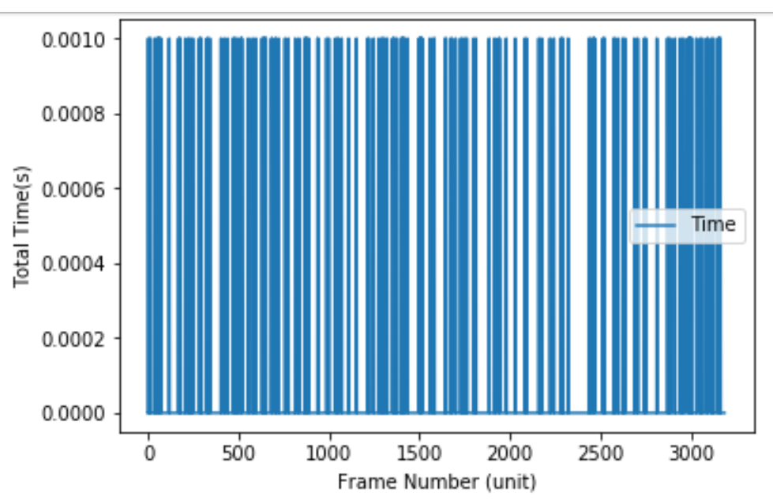

# MPM
Implementation of the Material Point Method using C++ and Cuda.

# Requirements

**OS:** Windows10  
**IDE:** VisualStudio 2017  
**Cuda:** 10.0

## How to Build

 *  Open VS 2017 and create a Solution.
 *  Clone the repository inside the directory solution:
 
 ``
 git clone https://github.com/dapalominop/MPM.git
 ``
 
 *  Inside the configuration of the project in VisualStudio configure the paths to include and libraries of Cuda and Opengl.
 *  Finally, build the project with VisualStudio.
 
 ## Results
 ### Paper Results
 
 

  

    
    
  

  

    
    
  

  

### Own Implementation Results 

  

    
    
  

 
 
 
## Contact
If you need any help you can contact me to:
 
**Author:** Daniel Palomino  
**Mail:**   dapalominop@gmail.com
